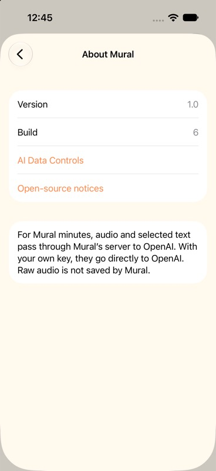

# Visible iOS build number — October 10, 2026

Settings → About Mural now shows **Version** and **Build**, read directly from the running app’s bundle metadata. The display was added on main in `1b18a825c802a037ddfa4e4ea5f9c4ba36a9673a`. Build 6 is aligned in the Xcode project and project generator.

- Simulator build passed. Using an offline `--preview --preview-key` launch, navigated through Settings to About Mural and verified the native accessibility text `Version, 1.0` and `Build, 6`. The screenshot below was visually inspected; both rows are fully visible. The simulator app was then stopped.
- Signed iPhone build and strict deep signature verification passed. Log: `/tmp/mural-iphone-build-6.log`.
- Installed over the existing `louisar.mural.swedish` app on the owner’s iPhone 17 Pro. Device readback confirms version 1.0, build 6. Receipts: `/tmp/mural-main-iphone-install-6.json` and `/tmp/mural-delivery-build-6-installed.json`.
- No phone app launch, voice call, billable API check, key change or data reset was performed. Phone-side visual interaction remains for the owner to try.
- This bundle-metadata display uses no server API and needs no deployment. Hosted features remain disabled in the personal build.

