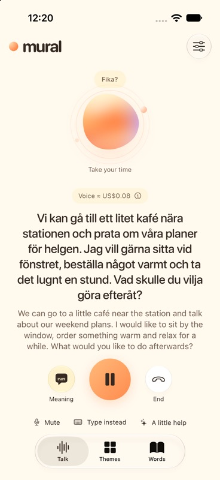

# iOS microphone mute restored — October 10, 2026

The review branch restores a separate Mute/Unmute action in the existing Talk footer during personal-key calls. The main orange control remains Pause. Muting uses the existing microphone transport control, keeps the connection active and leaves the voice estimate running. Pause remains available while muted; resuming restores microphone input. Hosted calls keep their existing main-control mute action.

No server contracts, prompts, pricing, archive schema or transport behavior changed, so this addition needs no server deployment. No billable provider call, purchase, production deployment or phone installation was performed. Physical microphone behavior was not retested; verification used offline fixtures.

## Verification

- Simulator build and offline launch passed on iPhone 17 Pro / iOS 27.
- Signed generic iPhone build passed, with strict code-signature verification. Log: `/tmp/mural-mute-device-build.log`.
- Four targeted native UI checks passed, with zero failures or skips:
  - `testPersonalKeyCallCostAdvancesAndSheetPreservesCall`: mute/unmute preserves the active call and caption; the offline cost estimate advances while muted.
  - `testPauseResumeKeepsTranscriptAndCostAndSurvivesResetDelay`: a muted call can pause, retains its transcript and frozen paused estimate, and resumes with microphone input enabled.
  - `testPauseResumeAtLargestAccessibilityTextSize`: the separate Mute action and Pause/Resume remain reachable at the largest accessibility text size.
  - `testLongCaptionGetsMoreRoomAndMeaningRemainsVisible`: adaptive captions remain visible and call controls stay anchored.
- Result bundle: `/Users/louisar/Library/Developer/XcodeBuildMCP/workspaces/mural-swedish-8e3a08c2d814/result-bundles/test_sim_2026-10-10T10-17-53-751Z_pid85071_b350ac82.xcresult`.
- Inspected the native long-caption screenshot below: source, meaning, Pause, Mute, Type instead and A little help fit without clipping. The existing redundant cast warning in `AudioVerification.swift` remains non-blocking.

Use `--preview --preview-key --active-conversation --preview-language=sv --preview-long-caption` for an offline preview. This remains part of draft PR #2 on `codex/upstream-review-2026-10-10`; main and the installed iPhone app are unchanged.
